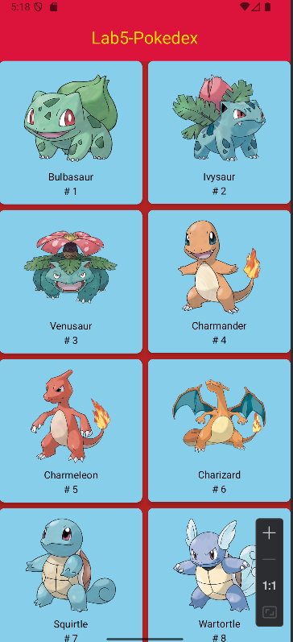
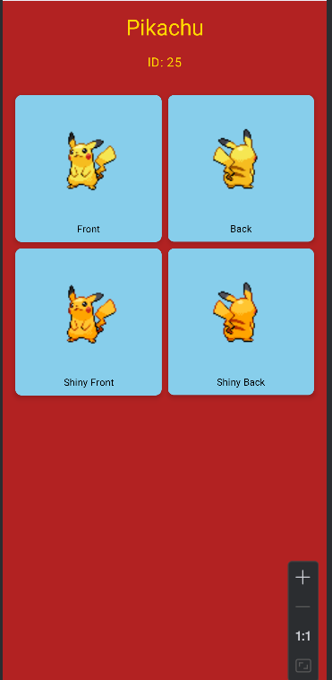

# Pokédex Android App

A modern Android application that brings the world of Pokémon to your fingertips! This app fetches and displays the first 100 Pokémon from the [PokéAPI](https://pokeapi.co/) with beautiful images and detailed information.

## Features

- **Browse Pokémon**: Explore the first 100 Pokémon with their official artwork
- **Detailed View**: Tap on any Pokémon to see more detailed images
- **Real-time Data**: Powered by PokéAPI for up-to-date Pokémon information
- **Clean UI**: Modern Android design following Material Design principles

## Built With

- **Kotlin** - Primary programming language
- **Retrofit** - HTTP client for API communication
- **PokéAPI** - RESTful API for Pokémon data
- **Android Jetpack** - Modern Android development components

## Screenshots

| Main Screen | Detail Screen |
|-------------|---------------|
|  |  |